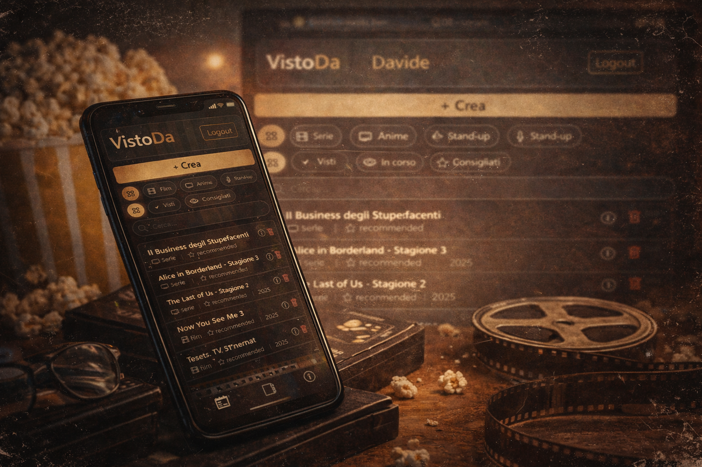

# 🎬 VistoDa

> Track movies and series you've watched — minimal, fast, clean.

[](https://vistoda.netlify.app/)

---

## Stack


---

## Features

- 🔐 JWT Authentication
- 👀 Demo read-only mode — try it instantly, no signup
- 🧩 Modular frontend (Vanilla JS + ES Modules)
- ⚙️ Environment-based config
- 🌐 Production-ready CORS

---

<!-- Screenshot preview — replace with actual image path after upload -->



---

## Try the Demo

👉 **[https://vistoda.netlify.app/](https://vistoda.netlify.app/)**

Use the **Demo** login on the homepage — no account needed.

---

## Local Development

```bash
# Backend
uvicorn app.main:app --reload

# Frontend
# Open with Live Server (VSCode)
```

---

## Project Structure

```

├── app/          # FastAPI backend
│   ├── main.py
│   ├── models/
│   ├── routes/
│   └── auth/
└── frontend/     # Vanilla JS frontend
    ├── index.html
    ├── js/
    └── css/
```
